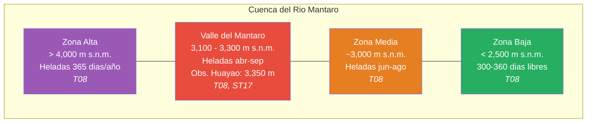
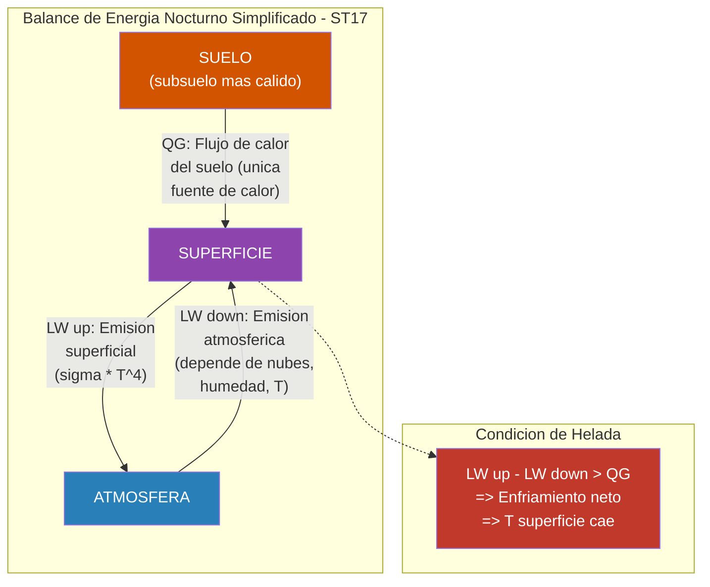
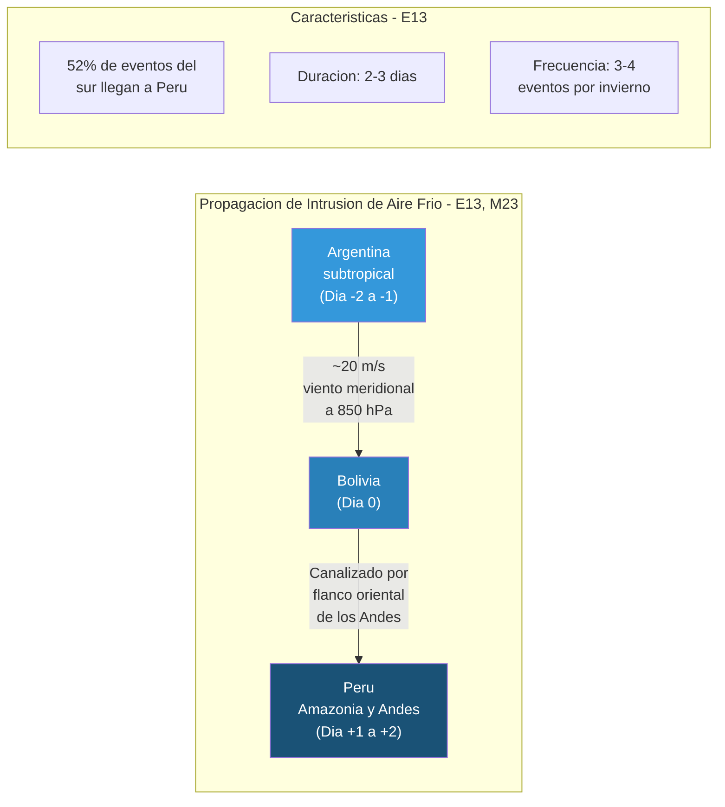
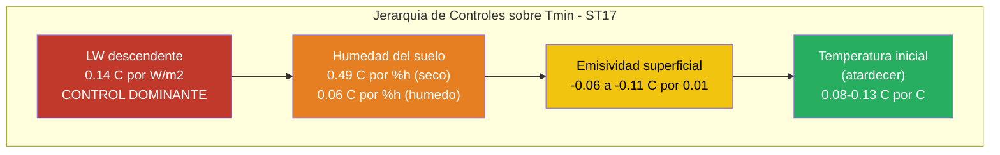
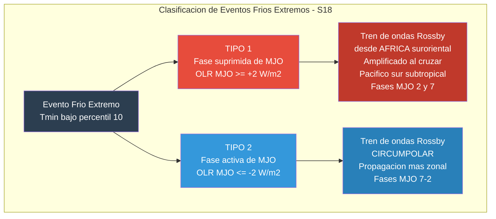
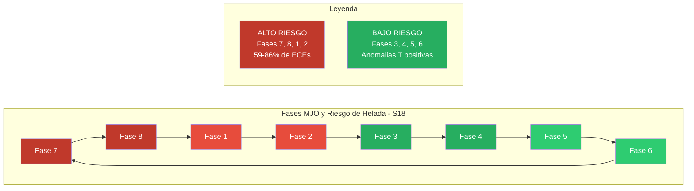
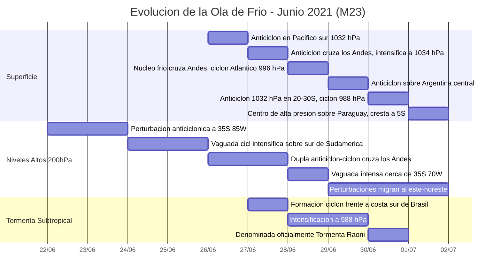
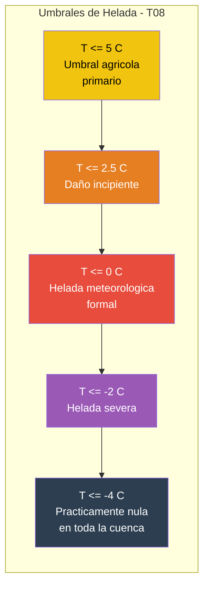
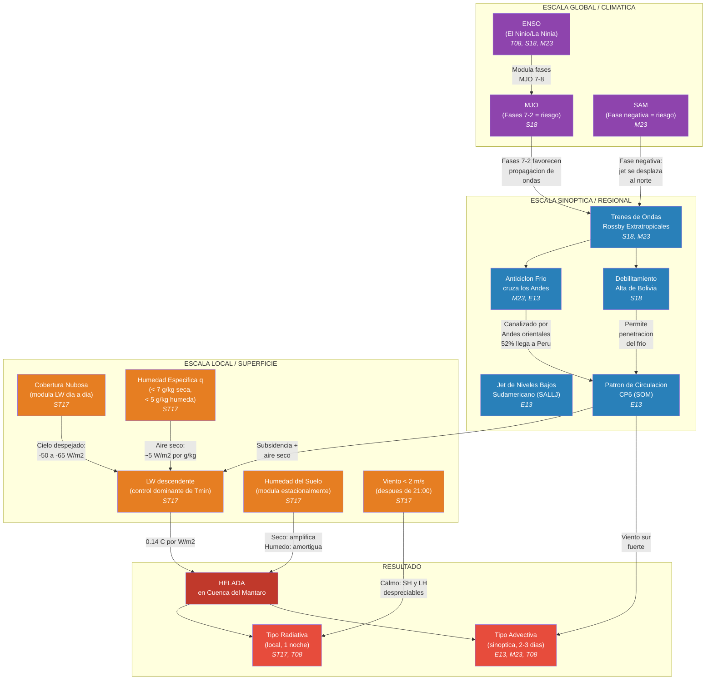

# Heladas en los Andes Centrales del Peru: Sintesis de la Literatura

> Documento de referencia que sintetiza los hallazgos de 6 investigaciones sobre eventos de frio extremo y heladas en los Andes centrales peruanos y Sudamerica. Toda cifra, umbral y mecanismo reportado proviene exclusivamente de las fuentes listadas.

---

## Indice de Fuentes

| ID | Autores | año | Titulo | Revista |
|----|---------|------|--------|---------|
| **T08** | Trasmonte, Chavez, Segura, Rosales | 2008 | Frost risks in the Mantaro river basin | Adv. Geosci. |
| **ST17** | Saavedra, Takahashi | 2017 | Physical controls on frost events in the central Andes of Peru | Agric. For. Meteorol. |
| **S18** | Sulca, Vuille, Roundy, Takahashi, Espinoza, Silva, Trasmonte, Zubieta | 2018 | Climatology of extreme cold events in the central Peruvian Andes during austral summer | Q. J. R. Meteorol. Soc. |
| **B21** | Bazo, de Perez, Jacome, Mantilla, Destrooper, Van Aalst | 2021 | Anticipation Mechanism for Cold Wave: Forecast Based Financing | Front. Clim. |
| **M23** | Marengo, Espinoza, Bettolli, Cunha, Molina-Carpio, Skansi, Correa, Ramos, Salinas, Sierra | 2023 | A cold wave of winter 2021 in central South America | Clim. Dyn. |
| **E13** | Espinoza, Ronchail, Lengaigne, Quispe, Silva, Bettolli, Avalos, Llacza | 2013 | Revisiting wintertime cold air intrusions at the east of the Andes | Clim. Dyn. |

---

## 1. Area de Estudio Comun

Las seis investigaciones convergen en la region de los **Andes centrales del Peru**, con enfasis en la **cuenca del rio Mantaro** y el **Observatorio de Huayao** del Instituto Geofisico del Peru (IGP).

| Parametro | Valor | Fuente |
|-----------|-------|--------|
| Ubicacion de la cuenca del Mantaro | 10 34'S - 13 35'S, 73 55'W - 76 40'W | T08 |
| Area de la cuenca | ~34,550 km2 | T08 |
| Altitud media | 3,800 m s.n.m. | T08 |
| Rango altitudinal | 500 - 5,350 m s.n.m. | T08 |
| Coordenadas del Observatorio de Huayao | 12.04 S, 75.32 W, 3,350 m s.n.m. | ST17 |
| Tipo de suelo en Huayao | Franco arcillo arenoso (56%), franco arcilloso (17%) | ST17 |
| Uso de suelo circundante | Tierra agricola no irrigada | ST17 |

---

## 2. Tipos de Heladas y sus Mecanismos Fisicos

Las fuentes identifican dos mecanismos fundamentalmente distintos de formacion de heladas en la cuenca del Mantaro.

### 2.1 Helada Radiativa (estacion seca: junio-agosto)

Es el tipo dominante. Se produce por perdida neta de radiacion de onda larga durante noches despejadas y secas **[ST17, T08]**.

**Mecanismo fisico segun ST17:**

1. Tras la puesta del sol, el balance de energia superficial queda dominado por la radiacion de onda larga (sin componente de onda corta).
2. La superficie emite LW ascendente (proporcional a T^4 via Stefan-Boltzmann) y recibe LW descendente de la atmosfera.
3. Bajo cielo despejado y aire seco, LW ascendente > LW descendente, generando **enfriamiento radiativo neto**.
4. La superficie se enfria por debajo de la temperatura del aire, creando una **inversion termica** cerca del suelo.
5. Con viento calmo (< 2 m/s despues de las 21:00 hora local), los flujos de calor sensible y latente son despreciables.
6. El unico flujo compensatorio es el **flujo de calor del suelo (QG)** desde el subsuelo mas calido hacia la superficie.
7. Si la perdida radiativa neta supera el aporte del suelo, la temperatura superficial cae por debajo de 0 C.
8. El enfriamiento continua hasta el amanecer (temperatura minima tipicamente a las ~06:00 hora local).

**Balance de energia nocturno (ecuacion simplificada de ST17):**

> **-kappa * dT/dz = -epsilon * LW_down + LW_up**

Donde:
- `kappa` = conductividad termica del suelo (W/m/K)
- `dT/dz` = gradiente termico vertical en el suelo
- `epsilon` = emisividad de la superficie (~1)
- `LW_down` = radiacion de onda larga descendente (W/m2)
- `LW_up` = radiacion de onda larga ascendente = sigma * T^4 (W/m2)

Los flujos de calor sensible (SH) y latente (LH) se desprecian bajo condiciones de helada radiativa porque el viento decae por debajo de 2 m/s despues de las 21:00 hora local y la atmosfera es muy estable (inversion termica) **[ST17]**.

### 2.2 Helada Advectiva (estacion lluviosa: septiembre-abril)

Causada por la **intrusion anomala de masas de aire frio y seco advectadas desde el sur del continente** **[T08, E13, M23]**. Estas intrusiones se canalizan a lo largo del flanco oriental de los Andes.

**Mecanismo de propagacion segun E13:**

1. Desarrollo de un frente frio en el sur de Argentina/cuenca del Plata, asociado a perturbaciones extratropicales.
2. La masa de aire frio es **canalizada hacia el norte** a lo largo de las laderas orientales de los Andes (efecto topografico).
3. Progresion de vientos del sur (meridionales) hacia latitudes bajas a 850 hPa.
4. **Subsidencia** en la troposfera media y baja acompania la intrusion.
5. Las condiciones secas y cielos despejados asociados a la subsidencia **refuerzan el enfriamiento por efecto radiativo** (retroalimentacion positiva).
6. La masa de aire frio converge con los vientos alisios tropicales, desplazandose progresivamente al norte.
7. El aire frio alcanza la Amazonia boliviana y peruana, causando eventos de **friaje/surazo**.

**Diferenciacion propagantes vs. no propagantes (E13):**
Las intrusiones que logran alcanzar la region tropical se caracterizan, **antes de llegar**, por una mayor ocurrencia de un patron de circulacion especifico (CP6 en la clasificacion SOM) asociado a: vientos del sur en niveles bajos progresando hacia latitudes bajas, subsidencia, y condiciones secas en la troposfera media y baja. Estas condiciones refuerzan el episodio frio mediante efecto radiativo.

### 2.3 Comparacion de ambos tipos

| Caracteristica | Helada Radiativa | Helada Advectiva |
|----------------|-----------------|-----------------|
| Temporada principal | Junio-agosto (seca) | Septiembre-abril (lluviosa) |
| Mecanismo | Perdida radiativa local nocturna | Intrusion de aire frio del sur |
| Condiciones de cielo | Despejado (requisito) | Inicialmente puede haber nubes |
| Humedad del aire | Muy baja (q < 7 g/kg) | Baja (q < 5 g/kg) |
| Velocidad del viento | Calmo (< 2 m/s despues de 21:00) | Fuerte (anomalias meridionales) |
| Duracion tipica | 1 noche | 2-3 dias |
| Escala espacial | Local | Subcontinental |
| Predictibilidad | Horas (condiciones de la tarde) | 1-3 dias (seniales sinopticas) |
| Fuentes | ST17, T08 | E13, M23, T08 |

---

## 3. Controles Fisicos de la Temperatura Minima

### 3.1 Jerarquia de Sensibilidad (ST17)

Saavedra y Takahashi (2017) cuantificaron la sensibilidad de la temperatura minima nocturna a cada factor fisico mediante un modelo de difusion termica 1D y el modelo de transferencia radiativa SBDART, ambos validados con campanas de campo en Huayao.

| Factor | Sensibilidad | Interpretacion | Rango analizado |
|--------|-------------|----------------|-----------------|
| **LW descendente** | **0.14 C por W/m2** | Control dominante | 200-350 W/m2 |
| Humedad del suelo (seco) | 0.49 C por %h | Muy fuerte en suelo seco | 0-10%h |
| Humedad del suelo (humedo) | 0.06-0.09 C por %h | Se satura | 20-40%h |
| Conductividad termica (seco) | 0.67 C por %h | Dominante sobre capacidad calorifica | ~0%h |
| Conductividad termica (10%h) | 0.25 C por %h | Un tercio del valor en seco | ~10%h |
| Emisividad superficial | -0.06 a -0.11 C por 0.01 | Mayor emisividad = mas enfriamiento | >0.9 |
| Temperatura inicial (atardecer) | 0.08-0.13 C por C | Relativamente debil | - |

### 3.2 Factores que modulan LW descendente (ST17)

LW descendente es a su vez controlada por:

**a) Cobertura nubosa (factor dominante dia a dia):**
- Noches con cielo despejado (0 octas): **~60% de probabilidad de helada** (mayo-agosto, 2003-2008).
- Noches con cielo cubierto (8 octas): **~5% de probabilidad de helada**.
- Nubes tipo estratocumulo con cobertura > 4/8 octas **previenen la helada** al incrementar LW descendente sustancialmente.
- Agregar solo 10 g/m2 de contenido liquido de agua en la nube (LWP) incrementa LW descendente en **~50 W/m2**.
- Por encima de LWP = 50 g/m2, la emisividad de la nube se satura (se aproxima a cuerpo negro).

**b) Humedad especifica (q):**
- Sensibilidad de LW descendente a q: **~5 W/m2 por g/kg** (promedio).
- Todos los dias de helada en estacion seca tuvieron **q < 7 g/kg**.
- Todos los dias de helada en estacion humeda tuvieron **q < 5 g/kg**.
- Estos umbrales son condicion necesaria pero no suficiente (q covaria con cobertura nubosa y humedad del suelo).

**c) Temperatura del aire:**
- Sensibilidad de LW descendente a temperatura: **~2.5 W/m2 por C** (casi constante).
- Menor impacto que la humedad especifica en esta altitud.

**Formulas empiricas para estimar LW descendente en cielo despejado (ST17):**

| Metodo | Formula | Desempeno en Huancayo |
|--------|---------|----------------------|
| Brutsaert | LW_down = 1.24 * sigma * T^4 * (e/T)^(1/7) | Error < 10 W/m2 |
| Brunt | LW_down = sigma * T^4 * (a + b * sqrt(e)) | Error < 10 W/m2 |
| Swinbank | LW_down = 9.2e-6 * sigma * T^6 | Sobreestima |
| Idso & Jackson | LW_down = sigma * T^4 * {1 - 0.26 * exp[-7.77e-4 * (T-273)^2]} | Sobreestima |

Donde T = temperatura del abrigo (K), e = presion de vapor de agua (hPa), sigma = 5.67e-8 W/m2/K4.

**Correccion por nubes (metodo de Bolz, en ST17):**

> LW_down = LW_down_cielo_despejado * (1 + k * w^2)

Donde w = fraccion de cobertura nubosa (0-1) y k depende del tipo de nube:

| Tipo de nube | k |
|-------------|---|
| Cirrus (Ci) | 0.04 |
| Cirrostratus (Cs) | 0.08 |
| Altocumulus (Ac) | 0.16 |
| Altostratus/Cb/Cu | 0.20 |
| Stratocumulus (Sc) | 0.22 |
| Nimbostratus/Niebla | 0.25 |

### 3.3 Efecto de la humedad del suelo (ST17)

| Humedad del suelo (%h) | 0 | 10 | 20 | 30 | 40 |
|-------------------------|---|----|----|----|----|
| Temperatura minima simulada (C) | -0.72 | 4.16 | 6.06 | 6.91 | 7.52 |
| Conductividad termica kappa (W/m/K) | 0.25 | 1.00 | 1.50 | 1.68 | 1.08 |
| Capacidad calorifica rho*C (10^6 J/m3/K) | 1.25 | 1.67 | 2.09 | 2.51 | 2.93 |

Pasar de suelo seco (0%h) a 10%h eleva la Tmin en **~5 C**. El efecto se satura a humedades mayores. Esto explica gran parte de la diferencia estacional: en la estacion humeda (nov-mar), el suelo humedo amortigua el enfriamiento; en la estacion seca (jul-sep), el suelo seco lo amplifica.

### 3.4 Validacion con campanas de campo (ST17)

Tres noches contrastantes (julio 15-18, 2010) en el Observatorio de Huayao:

| Noche | Tmin observada | q media (g/kg) | LW_down efectiva (W/m2) | Cielo | Resultado |
|-------|---------------|----------------|------------------------|-------|-----------|
| 15-16 jul | **-6.5 C** | 3 | 225 | Despejado | Helada severa |
| 16-17 jul | **+2.3 C** | 6 | 300 | Estratocumulo (cobertura total) | Sin helada |
| 17-18 jul | **-3.5 C** | 6 | 250 | Parcialmente despejado | Helada moderada |

La diferencia de **75 W/m2** en LW descendente entre la noche 1 (despejada) y la noche 2 (nublada) se traduce en una diferencia de **~8.8 C** en temperatura minima. De estos 75 W/m2 adicionales, solo 10 W/m2 se explican por diferencias en humedad y temperatura; los **65 W/m2 restantes provienen de las nubes estratocumulo**.

**Perfiles de temperatura del suelo observados (ST17):**
- A 2 cm de profundidad: amplitud diurna ~25 C.
- A 20 cm: amplitud ~3 C.
- A 30 cm: amplitud < 2 C.
- A 50 cm: amplitud practicamente cero (justifica condicion de frontera del modelo).

---

## 4. Climatologia y Tendencias de Heladas en la Cuenca del Mantaro

### 4.1 Patron estacional (T08)

- **Heladas permanentes** (todo el año): en altitudes >= 4,000 m s.n.m. (estaciones de Cerro de Pasco, Marcapomacocha, Laive).
- **Heladas estacionales** (abril-septiembre, pico en julio): en el Valle del Mantaro (3,100-3,300 m: Jauja, Huayao, Santa Ana).
- **Heladas restringidas** (junio-agosto): en altitudes ~3,000 m (Paucarbamba).
- **Heladas raras o inexistentes**: por debajo de ~2,500 m s.n.m. (San Lorenzo: 300-360 dias libres de heladas por año).

### 4.2 Relacion altitud-temperatura minima (T08)

Correlacion no lineal entre altitud y Tmin durante septiembre-abril: **r = 0.91 a 0.94**. Esta alta correlacion permite mapear la probabilidad de heladas en toda la cuenca a partir de datos orograficos, usando funciones polinomiales de **5to a 7mo orden**.

### 4.3 Tendencias en frecuencia de heladas (T08)

Analisis de tendencias lineales con regresion por minimos cuadrados (periodo 1960-2002, temporada lluviosa sep-abr, umbral Tmin <= 5 C):

| Estacion | Tendencia (dias/decada) | Significancia al 95% |
|----------|------------------------|---------------------|
| Jauja | **+14.8** | Si |
| Lircay | +12.4 | No (alta variabilidad) |
| Cerro de Pasco | +6 | No |
| Marcapomacocha | +3 | No |
| Huayao | **+2.8** | Si |
| Pilchaca | **-12.7** | Tendencia opuesta |

**Promedio de la cuenca: +8 dias/decada** de aumento en la frecuencia de heladas durante la temporada lluviosa.

### 4.4 Tendencias en intensidad de heladas (T08)

Los cambios en intensidad (Tmin mas baja por temporada) **no son robustos** en la cuenca:

| Estacion | Tendencia (C/decada) | Direccion |
|----------|---------------------|-----------|
| Marcapomacocha | +0.3 a +0.5 | Menos intensas |
| Cerro de Pasco | +0.3 a +0.5 | Menos intensas |
| Jauja | -1.0 | Mas intensas |
| Lircay | -0.4 | Mas intensas |
| Huayao | +0.05 | Sin tendencia |
| Pilchaca | +0.08 | Sin tendencia |

**Heladas extremas registradas (temporada lluviosa, sep-abr):**
- Marcapomacocha (4,413 m): Tmin llego a **-9.8 C**.
- Valle del Mantaro (Jauja, Huayao, Santa Ana): heladas extremas alcanzan **-3.8 C**.
- Paucarbamba (~3,000 m): Tmin nunca bajo de **0.1 C**.
- San Lorenzo (zonas bajas): Tmin nunca bajo de **6 C**.

### 4.5 Efecto de El Ninio (T08)

Durante el El Ninio fuerte de 1997-1998:
- Temperaturas **mucho mas calidas que lo normal** en casi toda la cuenca, especialmente diciembre 1997 - abril 1998.
- Anomalia extrema de **+4.7 C** en Huayao en febrero 1998.
- El periodo y frecuencia de heladas se **redujeron considerablemente**.

---

## 5. Eventos Frios Extremos y Teleconexiones

### 5.1 Clasificacion de eventos frios en verano austral (S18)

Sulca et al. (2018) clasifican los eventos frios extremos (ECE) del verano austral (enero-marzo) en la cuenca del Mantaro segun el signo de las anomalias de OLR en la banda MJO (30-100 dias, numeros de onda 0-9 hacia el este) en el punto 12.5 S, 75 W.

**Mecanismo comun a ambos tipos (S18):**
1. Adveccion de aire frio y seco a lo largo del flanco oriental de los Andes.
2. Propagacion ecuatorial de trenes de ondas Rossby extratropicales (ERWT).
3. Adveccion termica negativa en niveles troposfericos bajos.
4. Anomalias de viento sureste en superficie (intrusion de aire frio del sur).
5. Anomalias positivas de OLR sobre la cuenca del Mantaro (conveccion suprimida, cielos despejados).
6. Debilitamiento del sistema Alta de Bolivia - Baja del Nordeste (BH-NL) a 200 hPa.

### 5.2 Modulacion por la MJO (S18)

La Oscilacion Madden-Julian es un modulador critico de los eventos frios extremos en la cuenca del Mantaro:

| Aspecto | Fases MJO 7-2 | Fases MJO 3-6 |
|---------|--------------|--------------|
| Efecto sobre Tmin | Anomalias **negativas** | Anomalias **positivas** |
| Proporcion de ECE Tipo 1 | **59%** ocurren aqui | 41% restante |
| Proporcion de ECE Tipo 2 | **86%** ocurren aqui | 14% restante |
| Condicion para heladas | **Favorable** | **Desfavorable** |

### 5.3 Interaccion MJO-ENSO (S18)

- Tanto **El Ninio como La Ninia fortalecen las anomalias negativas de Tmin** durante las fases MJO 7-8.
- Tanto **El Ninio como La Ninia debilitan las anomalias positivas de Tmin** durante las fases MJO 3-6.
- Es decir, ENSO (en cualquier fase) amplifica la senal fria cuando la MJO ya predispone a eventos frios.

### 5.4 Modo Anular del Sur - SAM (M23)

A mediados de junio de 2021, el SAM entro en **fase negativa**, lo que favorecio las incursiones de aire muy frio en latitudes medias. La fase negativa del SAM implica:
- El cinturon de vientos del oeste se debilita y se desplaza hacia el ecuador.
- El jet subtropical se desplaza al norte.
- Mayor amplitud meridional del jet stream favorece la propagacion de ciclones y anticiclones hacia Sudamerica suroriental.

---

## 6. Patrones de Circulacion Atmosferica y Propagacion de Intrusiones

### 6.1 Clasificacion SOM de patrones de circulacion (E13)

Espinoza et al. (2013) aplicaron Mapas Auto-Organizados de Kohonen (SOM) combinados con Clasificacion Ascendente Jerarquica (HAC) sobre vientos diarios a 850 hPa del reanalisisis ERA-40 (1975-2001) para identificar **7 patrones de circulacion (CP)** del invierno austral.

**Parametros del SOM:**
- Mapa: 7 x 7 neuronas (49 vectores de referencia).
- Dominio: 10 N - 30 S, 50 W - 80 W (221 puntos de grilla, 2 variables = 442 dimensiones).
- Normalizacion: series de viento divididas por la desviacion estandar en cada punto de grilla.
- Criterio de agrupamiento: Ward (basado en distancia euclidiana).
- Filtrado temporal: filtro pasa-alto de Hanning con corte a 60 dias.

| CP | Frecuencia | Caracteristicas clave |
|----|-----------|----------------------|
| CP1 | 12% | Anomalias debiles de altura geopotencial; vientos alisios debiles |
| CP2 | 17% | Anomalias negativas de geopotencial; vientos del oeste/noroeste sobre la Amazonia |
| CP3 | 16% | Condiciones transitorias; convergencia y lluvia en la Amazonia sur |
| CP4 | 13% | Anomalia positiva de geopotencial; vientos del sur intensificandose hacia el norte |
| CP5 | 10% | Anomalias de viento del este; fin del "regimen de vientos del este" |
| **CP6** | **16%** | **Asociado a intrusiones frias que alcanzan Peru; subsidencia y condiciones secas** |
| CP7 | 16% | Baja del Chaco fortalecida; jet de niveles bajos (SALLJ) fuerte del norte |

**El ciclo completo de CP2 a CP7 se completa en aproximadamente 10 dias.**

### 6.2 Transicion de CPs durante intrusiones de aire frio (E13)

Las intrusiones de aire frio que alcanzan la Amazonia peruana corresponden a una **transicion organizada de CP1 (o CP7) hacia CP6** en el mapa de Kohonen. Las intrusiones que llegan al norte de Peru estan precedidas por condiciones frias en el sur de la cuenca del Plata y estan relacionadas con CP6 y, en menor medida, con CP5 y CP4.

### 6.3 Estadisticas de propagacion (E13)

| Parametro | Valor |
|-----------|-------|
| Porcentaje de eventos del sur que alcanzan la Amazonia peruana | **52%** |
| Velocidad de propagacion | **~20 m/s** (~72 km/h) |
| Duracion tipica | **2-3 dias** |
| Frecuencia | **3-4 eventos por invierno** (JJA) |
| Duracion en zona subtropical | ~60% duran ~1 dia |
| Duracion en zona tropical | ~15% duran hasta 3 dias |
| Magnitud del enfriamiento | Hasta **10 C en pocas horas** |

### 6.4 Evolucion sinoptica de la ola de frio de junio 2021 (M23)

Marengo et al. (2023) documentan en detalle la ola de frio mas intensa de las ultimas decadas en Sudamerica central. La evolucion sinoptica muestra:

**Rol de la Tormenta Subtropical Raoni:** Actuo como una "bomba" para el transporte rapido de aire frio hacia el norte, empujando el aire frio hasta los 5 S a lo largo de los Andes. Este forzamiento adicional amplifico la penetracion hacia el norte mas alla de lo que la interaccion anticiclon-ciclon sola habria producido.

**Tren de ondas Rossby:** Las perturbaciones de niveles altos formaban parte de un tren de ondas Rossby que se propagaba al este, generado por una fuente de calor sobre el oceano Indico tropical y el Pacifico occidental.

### 6.5 Temperaturas record durante la ola de 2021 (M23)

**Paraguay (30 junio):**

| Estacion | Tmin registrada | Tmin climatologica junio |
|----------|----------------|-------------------------|
| Mariscal Estigarribia | -2.6 C | 13.6 C |
| Pozo Colorado | -2.0 C | 13.5 C |
| Aeropuerto Guarani | -1.5 C | 12.8 C |

**Bolivia (records historicos en ~50 años):**

| Estacion | Fecha | Tmin registrada | Tmin climatologica | Nota |
|----------|-------|----------------|--------------------|----|
| Ascension de Guarayos | 30 jun | 1.2 C | 15.2 C | Record absoluto historico |
| Puerto Suarez | 4 jul | -2.5 C | 16.1 C | Temperatura mas baja jamas registrada |

**Anomalias a 850 hPa (M23):**
- Sur de Brasil (28 jun): **-8 C** de anomalia.
- Amazonia peruana/boliviana: **-4 C** de anomalia.

---

## 7. Definiciones y Umbrales Operativos

### 7.1 Umbrales de temperatura para heladas (T08)

Trasmonte et al. (2008) utilizan multiples umbrales, siendo el de **5 C** el umbral primario. Este fue determinado en talleres con especialistas agricolas basandose en la sensibilidad de los principales cultivos de la cuenca del Mantaro (maiz, papa, alcachofa).

**Probabilidad por zona y umbral (temporada lluviosa, T08):**

| Umbral | > 3,800 m s.n.m. | Valle Mantaro (3,100-3,300 m) | < 2,500 m s.n.m. |
|--------|------------------|------------------------------|-------------------|
| T <= 5 C | Muy alta (80-100%) | Baja a moderada (20-60%) | Muy baja (0-20%) |
| T <= 0 C | Muy alta (solo > 4,500 m) | Baja | Nula |
| T <= -2 C | Limitada a > 4,500 m | Muy baja | Nula |
| T <= -4 C | Practicamente nula | Nula | Nula |

**Categorias de probabilidad (T08):** Muy baja (0-20%), Baja (20-40%), Moderada (40-60%), Alta (60-80%), Muy alta (80-100%).

**Categorias de riesgo (T08):** Bajo, Moderado, Alto, Critico.

### 7.2 Definiciones formales de ola de frio

| Fuente | Definicion | Criterio de temperatura | Criterio de duracion |
|--------|-----------|------------------------|---------------------|
| **M23** | Ola de frio | Tmin **Y** Tmax simultaneamente bajo percentil 10 (1981-2010) | **3 o mas dias consecutivos** |
| **M23** | Ola de frio (spell) | Idem | Menos de 3 dias consecutivos |
| **B21** | Ola de frio operativa | Temperatura bajo **percentil 5** | **Mas de 4 dias consecutivos** |
| **E13** | Episodio frio | Tmin bajo **percentil 10** | Al menos 1 dia |

### 7.3 Umbrales operativos de alerta (B21)

Bazo et al. (2021) documentan el sistema de alerta de SENAMHI y los umbrales del mecanismo de Financiamiento Basado en Pronostico (FbF):

| Parametro | Valor |
|-----------|-------|
| Nivel de alerta SENAMHI que activa FbF | **Nivel 4** (el mas alto) |
| Probabilidad del pronostico requerida | **60-80%** |
| Umbral de nevada | **20 mm** |
| Umbral de temperatura | Por debajo del **percentil 5** |
| Duracion requerida | **Mas de 4 dias consecutivos** |
| Tiempo de anticipacion | **96 horas** (4 dias) con pronostico a 5 dias |
| Tiempo real de distribucion (caso 2018) | **3 dias antes** de que la nieve golpeara las comunidades |

**Los 9 indicadores de riesgo del sistema FbF (B21):**
1. Frecuencia de nevadas
2. Percentiles bajos de temperatura
3. Tasa de neumonia
4. Altitud
5. Poblacion sobre 3,500 m s.n.m.
6. Indice de pobreza
7. Poblacion de alpacas
8. Poblacion de adultos mayores (> 65 años)
9. Ninos menores de 5 años

---

## 8. Impactos Documentados

### 8.1 Impactos historicos en Peru (B21)

| año | Impacto | Fuente citada por B21 |
|------|---------|----------------------|
| 2003 | **62 personas fallecidas** (ancianos y ninos < 5 años); grandes perdidas de camelidos sudamericanos | IFRC 2003 |
| 2007 | **65,300 animales muertos**; **48 ninos fallecidos** | IFRC 2008 |
| 2013, 2015, 2016 | Eventos similares documentados | B21 |
| 2003-2019 | **7,361 eventos de ola de frio y nevada** reportados por Defensa Civil | B21 |

Los eventos se concentran en departamentos centrales y del sur por encima de 3,500 m s.n.m., principalmente en Arequipa, Puno, Huancavelica, Cusco, Moquegua y Tacna.

**Mecanismo de trampa de pobreza (B21):** Cuando los rebanos caen por debajo de ciertos umbrales, se vuelven inviables. Los ganaderos pueden abandonar la actividad pastoril y emprender migracion por destitution hacia areas urbanas.

### 8.2 Impactos de la ola de frio de 2021 (M23)

**Cafe (impacto mas severo):**
- Cosecha brasilena 2021/2022 cayo un **30%**.
- 150,000-200,000 hectareas afectadas (~11% del area total de arabica).
- Perdida estimada: 2.5-5.5 millones de sacos (potencialmente 10 millones en el peor caso).
- Minas Gerais (mayor estado productor): 30% del area danada; descrito como "lo peor en 27 años, desde 1994".
- Precio del cafe supero **USD 2.00/lb** el 26 de julio 2021 (maximo desde octubre 2014).
- Repercusiones potenciales de hasta 4 años.

**Otros cultivos:** cania de azucar (-4.6% en cosecha), maiz (hasta -30% en productividad), naranjas, uvas y hortalizas con danos significativos.

**Salud:** 13 personas en situacion de calle fallecieron por hipotermia en Sao Paulo.

**Ecosistemas:** En Chiquitania y Pantanal (Bolivia), heladas sin precedentes o extremadamente raras causaron danos adicionales a vegetacion ya debilitada por incendios previos. Probablemente el evento de frio mas intenso en ~50 años en esas regiones.

### 8.3 Comparacion historica de grandes olas de frio (M23)

| Caracteristica | Julio 1975 | Junio 1994 | Junio 2021 |
|----------------|-----------|-----------|-----------|
| Intensidad del anticiclon | 1044 hPa a ~25 S | 1036 hPa | 1032 hPa a 25-30 S |
| Impacto en cafe de Brasil | Destruyo 51% de la cosecha; USD 75M en perdidas | Caida drastica en produccion; aumento dramatico del precio | -30% en produccion; miles de millones de Reais |
| Temperaturas notables | Pucallpa 8.0 C (clim. 21.0 C) | Sao Paulo 2.5 C | Guarayos 1.2 C (record), Puerto Suarez -2.5 C (record) |

### 8.4 Resultados del FbF Peru 2018 (B21)

El estudio cuasi-experimental de Bazo et al. (2021) evaluo el impacto de la asistencia anticipada vs. comunidades sin intervencion:

| Resultado | Grupo intervencion | Grupo comparacion | p-valor |
|-----------|-------------------|-------------------|---------|
| Mortalidad de alpacas | ~30% **menor** | Referencia | 0.02 (Kolmogorov-Smirnov) |
| Migracion a zonas bajas | **11%** | Significativamente mayor | 0.01 (Chi-cuadrado) |
| Afecciones respiratorias (adultos) | Menos casos reportados | Referencia | 0.08 (Chi-cuadrado) |

**Acciones tempranas tomadas por las comunidades intervenidas:**

| Accion | Porcentaje |
|--------|-----------|
| Antiparasitarios, antibioticos y vitaminas para el ganado | 46% |
| Proteger cobertizos con lonas impermeables | 22% |
| Migrar a zonas de menor altitud | 19% |
| Sacar animales mas temprano | 9% |

---

## 9. Tendencias de Largo Plazo y Contexto Climatico

### 9.1 Tendencias globales en extremos frios (M23)

- La frecuencia e intensidad global de extremos frios han **disminuido desde 1950** (menos noches frias en Sudamerica).
- HADEX3 (1950-2018): reduccion de **1-2 dias de condiciones frias** (TN10) por decada en America Central y Sudamerica tropical.
- Norte de Argentina, sur de Brasil, Paraguay: tendencias significativas a la baja en noches frias (TN10) y dias frios (TX10) en 1979-2017.

### 9.2 Contexto climatico 2021 (M23)

- Condiciones La Ninia activas (desde finales de 2020), contribuyendo a la sequia en la cuenca Parana-La Plata.
- Ademas de la ola de frio: inundacion inusualmente grande en la Amazonia norte/central (junio 2021) y sequia extrema en el sur de Brasil.
- Ambos extremos hidroclimaticos vinculados a una celda de Hadley continental intensificada.
- **Evento compuesto**: la combinacion de frio extremo y condiciones de sequia persistente desde 2019 en la cuenca Parana-La Plata creo un evento compuesto que amplifico las perdidas agricolas.

### 9.3 Condiciones antarticas inusuales (M23)

- Polo Sur mas frio de lo habitual en junio-julio 2021.
- Fuertes anomalias frias sobre gran parte de la Antartida.
- Concentracion de hielo marino mayor de lo normal al oeste de la Peninsula Antartica, al norte de los mares de Bellingshausen y Amundsen.

---

## 10. Terminologia Regional

El mismo fenomeno de intrusion de aire frio recibe distintos nombres segun el pais (E13):

| Termino | Region | Significado |
|---------|--------|-------------|
| **Friaje** | Amazonia peruana | Evento de frio extremo |
| **Infiernillo** | Amazonia peruana | Variante del friaje |
| **Surazo** | Bolivia | Indica direccion del viento (del sur) |
| **Friagem** | Brasil | Equivalente portugues de friaje |
| **Aru** | Colombia | Intrusion de aire frio |

---

## 11. Sintesis: Mapa Conceptual Integrado

---

## 12. Datos y Metodologias Empleadas por Cada Fuente

| Fuente | Periodo | Datos | Metodo principal |
|--------|---------|-------|-----------------|
| **T08** | 1960-2002 | 17 estaciones, Tmin diaria, GIS (orografia, suelos, uso de tierra) | Regresion lineal de tendencias, polinomios altitud-probabilidad (5to-7mo orden), mapeo de riesgo en ArcView |
| **ST17** | 2003-2008 (estadistico), jul 2010 (campanas) | Pirgeonmetro CGR3, 7 geotermometros (0-50 cm), 7 termometros de aire (10-140 cm), GOES IR4 | Modelo SBDART (transferencia radiativa), modelo 1D de difusion termica del suelo, diferencias finitas |
| **S18** | 1979-2010 | Reanalisisis (ERA-Interim probable), OLR NOAA, Tmin estaciones | Filtrado espectral de numeros de onda-frecuencia (banda MJO: 30-100 dias), composites, indice RMM |
| **B21** | 2003-2019 (impactos), mayo-jun 2018 (caso) | Alertas SENAMHI, 166 encuestas (79 intervencion, 87 comparacion) | Estudio cuasi-experimental, test Kolmogorov-Smirnov, Chi-cuadrado |
| **M23** | Jun-ago 2021 | 36 estaciones (5 paises), ERA5 (0.28 grados), CPC, GPCC | Filtro Butterworth paso-banda (1-30 dias), composites, analisis sinoptico |
| **E13** | 1975-2001 | Estaciones (Argentina, Bolivia, Peru), ERA-40 (2.5 x 2.5 grados) | SOM Kohonen (7x7) + HAC Ward, filtro Hanning (60 dias), composites |

---

## 13. Cifras Clave Consolidadas

### Umbrales de humedad especifica para heladas (ST17)

| Estacion | Umbral de q | Condicion |
|----------|------------|-----------|
| Seca (jun-ago) | q < 7 g/kg | Necesaria pero no suficiente |
| Humeda (nov-mar) | q < 5 g/kg | Necesaria pero no suficiente |

### Sensibilidades del modelo fisico (ST17)

| Variable | Sensibilidad sobre Tmin |
|----------|------------------------|
| LW descendente | 0.14 C por W/m2 |
| Humedad del suelo (0-10%h) | ~0.49 C por %h |
| Humedad del suelo (20-40%h) | ~0.06-0.09 C por %h |
| Humedad especifica sobre LW descendente | ~5 W/m2 por g/kg |
| Temperatura del aire sobre LW descendente | ~2.5 W/m2 por C |
| LWP nubes sobre LW descendente (primeros 10 g/m2) | ~50 W/m2 |
| Temperatura inicial (atardecer) | 0.08-0.13 C por C |

### Estadisticas de intrusiones de aire frio (E13)

| Parametro | Valor |
|-----------|-------|
| Eventos que llegan del sur a Peru | 52% |
| Velocidad de propagacion | ~20 m/s |
| Duracion tipica | 2-3 dias |
| Frecuencia invernal | 3-4 por JJA |
| Caida de temperatura | Hasta 10 C en pocas horas |

### Tendencia de heladas en temporada lluviosa (T08)

| Parametro | Valor |
|-----------|-------|
| Tendencia promedio de la cuenca | +8 dias/decada |
| Mayor tendencia (Jauja) | +14.8 dias/decada |
| Correlacion altitud-Tmin | r = 0.91-0.94 |
